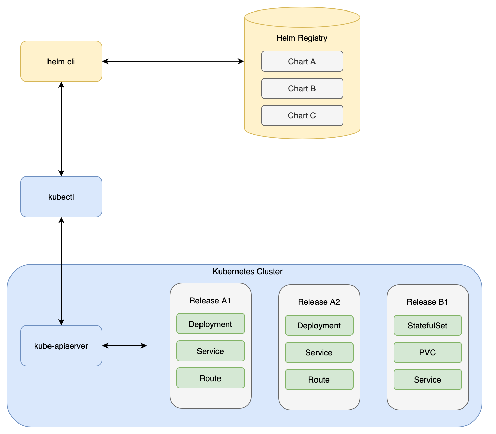

## The problem

As you know, Kubernetes runs on desired state configuration - to create resources (applications, networking, persistence, etc) you post YAML documents to an API and Kubernetes makes it so with event driven and looping automations. As Kubernetes grew in popularity and diverse flavors of Kubernetes became available, the open source community discovered a problem: even though Kubernetes YAML manifests are well defined and versioned, sometimes implementation details of a particular cluster require small changes to YAML in order for it to be usable across clusters. For an example, look at two requests for persistent storage for a database on two different clusters:

In the first cluster, an admin of the cluster arbitrarily called the StorageClass "slow":

```yaml
apiVersion: v1
kind: PersistentVolumeClaim
metadata:
  name: db
spec:
  accessModes:
    - ReadWriteOnce
  volumeMode: Filesystem
  resources:
    requests:
      storage: 8Gi
  storageClassName: slow    # here
  selector:
    matchLabels:
      app: "db"
      env: "dev"
```

...and in the second, their admin called the StorageClass "cheap":

```yaml
apiVersion: v1
kind: PersistentVolumeClaim
metadata:
  name: db
spec:
  accessModes:
    - ReadWriteOnce
  volumeMode: Filesystem
  resources:
    requests:
      storage: 8Gi
  storageClassName: cheap    # here
  selector:
    matchLabels:
      app: "db"
      env: "dev"
```

If you were trying to share the YAML manifests for this database publicly, you'd need to add a caveat to "check that one value in the PVC YAML to make sure the StorageClass was correct" - that's not a very elegant solution, and it doesn't scale for complex application architectures requiring many YAML resources. This problem started to be noticed by the community at large, and eventually Helm arose to solve the problem of making YAML sharable and deployable anywhere.

Helm is self-described as "a package manager for Kubernetes". Helm works to solve two primary problems Kubernetes doesn't on its own:

1. Provide a standard syntax, directory structure, and packaging mechanisms to templatize YAML and make it sharable
1. Provide light YAML lifecycle management in Kubernetes (install, upgrade, rollback, uninstall YAML in bulk as versioned releases)

Generally, you'll want to use Helm when you have a set of YAML documents you want to deploy many many times in a nearly identical way. Some examples:

1. A highly available stateless web application with autoscaling
1. A scheduled task
1. Your favorite open source databases, caches, CI/CD platforms, visualization tools, etc

All of these generic types of applications can be packaged into a generic Helm **chart** (a named and versioned "package" of templated YAML resources), which expose a set of parameters called **values** that act like an API to that YAML you can set for your specific implementation. For example, a highly-available web app (chart) might always include a Deployment, a Service, a Route, and a HorizontalPodAutoscaler, but some specifics (values) might be unqiue per instance, like:

1. The container image to use
1. Configuration data (environment variables, ConfigMaps, and/or Secrets)
1. The min/max scale of Pods
1. The min/max CPU/RAM requirements
1. The domain name of the application

When you render a chart with specific values and deploy that bundle of YAML to Kubernetes, Helm manages all the YAML together as a named and versioned **release**, which can be upgraded, rolled back, and/or deleted as a *single unit* over time. Helm also includes **chart dependency management**, so if you have 10 stateless web apps, 1 cache, and 1 database, you can bundle all *those* charts together into a single deployable application stack in a new chart. We hope the power of all these patterns will become obvious throughout this workshop - Helm can save a lot of copy-pasting YAML and keep conformance of YAML across a team or organization by making the best path also the easiest for teams to use.

## A brief history

Helm v1.0 was released on Feburary 23, 2016 (about 7 months after Kubernetes v1.0). Since that time, it's undergone several large feature and architectural changes. The current major version of Helm is v3, and it's highly recommended that you use this version. Primarily, the v3 `helm` CLI has a much better architecture - in previous versions, Helm had a client/server architecture, and the server side (hosted in Kubernetes) required *cluster admin permissions* in order to apply manifests of any kind to any Namespace in the cluster. v3 `helm` practices the principle of least privilege by eliminating the server component entirely (previously called `tiller`) and instead applies manifests locally through `kubectl`. This means each time you use the `helm` CLI, your permissions are bound by your current RBAC context. This improves security (no cluster admin permissions required), robustness (no `tiller` downtime), and makes `helm` easier to use too (no server to install to get started; just download the CLI).

TL;DR: If you use `helm`, use v3.

## Architecture

With v3 Helm, the arctictecture looks something like this:



You'll notice you can have multiple releases of a single chart in a single cluster (e.g. unique releases of PostgreSQL rendered from a common PostgreSQL chart).

## Limitations

While Helm can be a great way to share, render, and manage ***YAML documents*** in Kubernetes, Helm does little to manage ***applications, their data, and their lifecycles***. For advanced use cases, you might consider using Operators to handle lifecycle management of applications.

## Summary

In this section you learned:

1. The problems Helm attempts to solve (YAML lifecycle management) and those it doesn't (application/data lifecycle management)
1. The difference between Helm charts, values, and releases
1. A brief history of Helm, and that you should be using Helm v3
1. The architecture of Helm and how it fits into the Kubernetes/OpenShift ecosystem

## Up next

Next, you'll use `helm` to query and install open source charts into OpenShift
